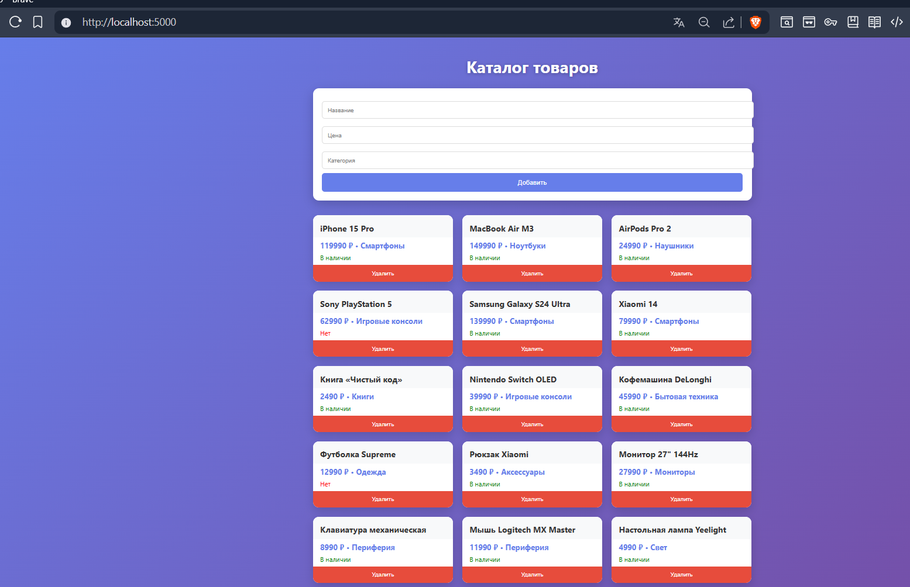

# Каталог товаров — контрольная работа по Express.js + React


## Функционал приложения

- Просмотр всех товаров
- Добавление нового товара
- Удаление товара
- градиент)
- 15 товаров

## Как запустить проект

```bash

# 1. Собрать React-приложение
cd ../frontend
npm run build

# 2. Запустить сервер
cd ../backend
node server.js


```
## Скриншоты



